<div align="center">



<br>


</div>

<br>

## `> quem_sou`

```text
┌────────────────────────────────────────────────────────────┐
│                                                            │
│  NOME      :: Paulo Gabriel                               │
│  PAÍS      :: Brasil                                      │
│  ESCOLA    :: ETEC Valdivino Antonio Marcusso             │
│  CURSO     :: Desenvolvimento de Sistemas                 │
│  FOCO      :: Cibersegurança                              │
│  STATUS    :: ATIVO                                       │
│                                                            │
└────────────────────────────────────────────────────────────┘
```

## `> sobre_mim`

```text
Sou estudante do Ensino Médio Técnico em
Desenvolvimento de Sistemas.

Estou construindo minha base em programação
através de projetos, estudos e prática.

Atualmente estudo desenvolvimento web,
lógica de programação, banco de dados,
Git e GitHub.

Também estou iniciando meus estudos em
Cibersegurança.

Objetivo:

> aprender
> testar
> construir
> melhorar
> evoluir
```

---

## `> tecnologias_carregadas`

<div align="center">


</div>

<br>

```text
pgabriel-dev/
│
├── desenvolvimento/
│   ├── HTML
│   ├── CSS
│   └── JavaScript
│
├── banco_de_dados/
│   └── MySQL
│
├── ferramentas/
│   ├── Git
│   ├── GitHub
│   └── VS Code
│
└── seguranca/
    └── ciberseguranca...
```

---

## `> foco_atual`

```diff
+ Desenvolvimento Web
+ Lógica de Programação
+ Banco de Dados
+ Git e GitHub
+ Projetos práticos

! Cibersegurança em aprendizado
! Conhecimento em construção
! Experiência aumentando
```

---

## `> executar perfil.js`

```javascript
const paulo = {

    formacao: "Desenvolvimento de Sistemas",

    conhecimentos: [
        "HTML",
        "CSS",
        "JavaScript",
        "MySQL",
        "Git",
        "GitHub"
    ],

    estudando: [
        "Desenvolvimento Web",
        "Banco de Dados",
        "Cibersegurança"
    ],

    objetivo: "Transformar conhecimento em experiência",

    futuro: "Trabalhar profissionalmente com tecnologia"
};
```

---

## `> monitor_do_sistema`

```text
╔════════════════════════ MONITOR ════════════════════════╗
║                                                        ║
║  Desenvolvimento Web ......................... ATIVO   ║
║  Banco de Dados .............................. ATIVO   ║
║  GitHub ...................................... ATIVO   ║
║  Projetos .................................... CRIANDO ║
║  Cibersegurança .............................. ESTUDO  ║
║  Experiência ................................. +1      ║
║                                                        ║
╚════════════════════════════════════════════════════════╝
```

---

## `> conexoes`

<div align="center">

<a href="https://github.com/pgabriel-dev">

</a>

<a href="https://instagram.com/_pgxzt">

</a>

<a href="COLE_AQUI_O_LINK_DO_SEU_LINKEDIN">

</a>

</div>

<br>

```text
[VARREDURA]

GitHub     :: pgabriel-dev
Instagram  :: @_pgxzt
LinkedIn   :: Paulo Gabriel Da Silva Lopes

[STATUS] conexões localizadas.
```

---

## `> registro_do_sistema`

```log
[21:04:01] [INÍCIO] Perfil carregado
[21:04:02] [ OK ] Ambiente de desenvolvimento iniciado
[21:04:03] [ OK ] GitHub conectado
[21:04:04] [ OK ] Tecnologias carregadas
[21:04:05] [INFO] Modo de aprendizado ativado
[21:04:06] [INFO] Projetos em construção
[21:04:07] [ >> ] Cibersegurança carregando...
[21:04:08] [ >> ] Novos conhecimentos detectados...
[21:04:09] [SISTEMA] Continue evoluindo_
```

---

<div align="center">


<br>

```text
╔════════════════════════════════════════════════════════════╗
║                                                            ║
║                    CONSTRUIR HOJE                          ║
║                    PROTEGER AMANHÃ                         ║
║                                                            ║
║                      SISTEMA ATIVO                         ║
║                                                            ║
╚════════════════════════════════════════════════════════════╝
```



</div>

